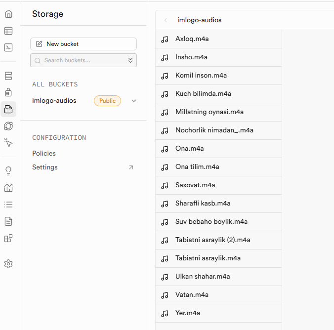

# Imlo Go loyihasi qo'llanmalari

## 1. Kirish

**Maqsad:** Foydalanuvchilarga qulay interfeys orqali diktant yozish, uni avtomatik tekshirtirish va xatolar ustida ishlash imkoniyatini berish.

**Platformalar:**
*   Web
*   Windows
*   Android
*   iOS

## 2. Loyihaning Arxitekturasi va Ishlatilgan Texnologiyalar

Loyiha zamonaviy va samarali texnologiyalar yordamida ishlab chiqilgan bo‘lib, quyidagi asosiy komponentlardan tashkil topgan:

### 2.1. Frontend (Foydalanuvchi Interfeysi)
*   **Texnologiya:** Flutter Framework
*   **Afzalliklari:**
    *   Bir martalik kod bazasi orqali bir nechta platforma (Web, Desktop, Mobile) uchun ilova yaratish imkoniyati.
    *   Chiroyli va tez ishlaydigan foydalanuvchi interfeyslarini yaratish uchun keng imkoniyatlar.
    *   Faol hamjamiyat va ko‘plab tayyor paketlar (kutubxonalar).

### 2.2. Audio Kontentni Boshqarish
*   **Audio ijrosi uchun:** `audioplayers` Flutter paketi.
    *   **Vazifasi:** Diktant audio yozuvlarini ilova ichida ijro etish.
*   **Audio fayllarni saqlash uchun:** Supabase Cloud Storage.
    
    *   **Vazifasi:** Diktant audio fayllarini (masalan, `.m4a` formatida) bulutli serverda xavfsiz saqlash va ularga URL orqali murojaat qilish.
    *   **Afzalliklari:** Ishonchli, masshtablanuvchi va qulay boshqaruv paneli.

### 2.3. Diktant Matnlari va Ma’lumotlarini Saqlash
*   **Texnologiya:** Statik NoSQL (JSON) ma’lumotlar bazasi.
*   **Vazifasi:** Diktantlar haqidagi asosiy ma’lumotlarni (ID, sinf, yosh toifasi, sarlavha, matn, audio URL manzili va hokazo) saqlash.
*   **Sababi:** Loyihaning dastlabki bosqichida backend (server qismi) yaratishga ketadigan vaqtni tejash va tezroq ishga tushirish. Ma’lumotlar JSON fayllarida oldindan tayyorlanib, ilovaga biriktiriladi yoki serverdan yuklab olinadi.
*   **Ma’lumotlar bazasi strukturasi (misol):**
    ```json
    [
      {
        "id": 1,
        "className": "1-sinf",
        "ageName": "7-8 yosh", // Yosh toifasi aniqroq
        "title": "ULKAN SHAHAR",
        "text": "Toshkent ko‘p millatli ulkan shahar bo‘lib, hozir unda 3 millionga yaqin aholi yashaydi. Uning chiroyi kundan-kunga ortib boryapti.",
        "wordCount": 26, // So'zlar soni (dasturiy hisoblash mumkin)
        "estimatedTimeMinutes": 2, // Diktant uchun taxminiy vaqt (daqiqa)
        "audioUrl": "https://jvqhqinpulczyhgckgbb.supabase.co/storage/v1/object/public/imlogo-audios//Ulkan%20shahar.m4a"
      },
      {
        "id": 2,
        // ... keyingi diktant ma'lumotlari ...
      }
    ]
    ```

### 2.4. Foydalanuvchi Natijalarini Mahalliy Saqlash
*   **Texnologiya:** Hive DB (Flutter uchun tezkor NoSQL ma’lumotlar bazasi).
*   **Vazifasi:** Foydalanuvchining bajargan diktantlari natijalarini (olgan ballari, xatolari, yozgan matni va hokazo) qurilmaning o‘zida (mahalliy) saqlash.
*   **Afzalliklari:** Tez ishlashi, Flutter bilan oson integratsiyasi, offline rejimda ham ishlash imkoniyati.
*   **Saqlanadigan ma’lumotlar strukturasi (`Work` klassi misolida):**
    ```dart
    // Dart klassi (Hive uchun adapter generatsiya qilinadi)
    // @HiveType(typeId: 0) // Misol uchun typeId
    class Work {
      // @HiveField(0)
      String id; // Unikal identifikator (masalan, UUID yoki timestamp)

      // @HiveField(1)
      String diktantId; // Qaysi diktantga tegishli ekanligi (JSON bazadagi ID)

      // @HiveField(2)
      DateTime createdDate; // Topshirilgan sana va vaqt

      // @HiveField(3)
      double score5Point; // 5 ballik tizimdagi baho

      // @HiveField(4)
      double score100Point; // 100 ballik tizimdagi ball (3-usul bo'yicha foiz)

      // @HiveField(5)
      List<DetectedErrorHive> errors; // Aniqlangan xatolar ro'yxati (Hive uchun moslashtirilgan)

      // @HiveField(6)
      String originalDiktantTitle; // Original diktant sarlavhasi

      // @HiveField(7)
      String originalDiktantText; // Original diktant matni (qayta ko'rish uchun)

      // @HiveField(8)
      String userInputText; // Foydalanuvchi kiritgan matn

      // @HiveField(9)
      int imloErrorCount; // Unikal imlo xatolari soni

      // @HiveField(10)
      int punktuatsionErrorCount; // Unikal punktuatsion xatolar soni

      // @HiveField(11)
      int uslubiyErrorCount; // Unikal uslubiy xatolar soni

      // @HiveField(12)
      int grafikErrorCount; // Unikal grafik xatolar soni

      // @HiveField(13)
      int workTimeSeconds; // Diktantni bajarishga ketgan vaqt (sekundlarda)

      Work({
        required this.id,
        required this.diktantId,
        required this.createdDate,
        required this.score5Point,
        required this.score100Point,
        required this.errors,
        required this.originalDiktantTitle,
        required this.originalDiktantText,
        required this.userInputText,
        required this.imloErrorCount,
        required this.punktuatsionErrorCount,
        required this.uslubiyErrorCount,
        required this.grafikErrorCount,
        required this.workTimeSeconds,
      });
    }

    // DetectedError klassini Hive uchun moslashtirish kerak bo'ladi
    // @HiveType(typeId: 1)
    class DetectedErrorHive {
      // @HiveField(0)
      String type; // ErrorType.toString()

      // @HiveField(1)
      String description;

      // @HiveField(2)
      String originalFragment;

      // @HiveField(3)
      String userFragment;

      // @HiveField(4)
      String specificRuleCode;

      // @HiveField(5)
      double penaltyMultiplier;

      DetectedErrorHive({ /* ... */ });
    }
    ```
    *   **JSON Misoli (Hive ga saqlanadigan `Work` obyekti uchun):**
        ```json
        {
          "id": "uuid_string_123",
          "diktantId": "1", // JSON bazadagi diktant ID si
          "createdDate": "2023-10-27T10:30:00Z", // ISO 8601 formatida
          "score5Point": 4.0,
          "score100Point": 85.5,
          "errors": [
            {
              "type": "IMLO", // ErrorType.IMLO.toString().split('.').last
              "description": "So'zni noto'g'ri yozish",
              "originalFragment": "Toshkent",
              "userFragment": "Toshken",
              "specificRuleCode": "imlo_soz_almashtirish_toshkent_vs_toshken",
              "penaltyMultiplier": 1.0
            },
            {
              "type": "PUNKTUATSION",
              "description": "Tinish belgisi tushib qolgan",
              "originalFragment": ",",
              "userFragment": "",
              "specificRuleCode": "punkt_tushibqolgan_umumiy",
              "penaltyMultiplier": 1.0
            }
          ],
          "originalDiktantTitle": "ULKAN SHAHAR",
          "originalDiktantText": "Toshkent ko‘p millatli ulkan shahar bo‘lib...",
          "userInputText": "Toshken ko‘p millatli ulkan shahar bo‘lib...",
          "imloErrorCount": 1,
          "punktuatsionErrorCount": 1,
          "uslubiyErrorCount": 0,
          "grafikErrorCount": 0,
          "workTimeSeconds": 180 // Masalan, 3 daqiqa
        }
        ```

### 2.5. Diktantni Tekshirish Logikasi
*   **Komponent:** `DiktantEvaluator` klassi (Dart tilida, bu haqida quyiroqda ham batafsil to'xtalamiz).
*   **Vazifasi:** Foydalanuvchi matnini original matn bilan solishtirish, xatolarni aniqlash va baholash.
*   **Asosiy algoritmlar va yondashuvlar:**
    1.  **Tokenizatsiya:** Matnni so‘z va tinish belgilariga ajratish.
    2.  **Normallashtirish:** Tokenlarni solishtirish uchun standart ko‘rinishga keltirish.
    3.  **Alignment (Juftlashtirish):** Levenshtein masofasi algoritmi yordamida original va foydalanuvchi tokenlarini juftlashtirish (mos keladigan, almashtirilgan, tushib qolgan, ortiqcha tokenlarni aniqlash).
    4.  **Xatolarni Klassifikatsiya Qilish:** Aniqlangan farqlarni imloviy, punktuatsion, uslubiy, grafik xato turlariga ajratish. Maxsus qoidalar (masalan, "Zamon" vs "Xamon", "h" vs "x", tutuq belgisi, bosh harf, grafik belgilar) hisobga olinadi.
    5.  **"Bir Tipdagi Xato" Qoidasi:** Bir nechta joyda takrorlangan bir xil turdagi xatoni bitta deb hisoblash.
    6.  **"Katastrofik Nomuvofiqlik"ni Aniqlash:** Foydalanuvchi matni originalga umuman mos kelmaganda (masalan, ma’nosiz so‘zlar kiritilganda) alohida ishlov berish va bahoni keskin pasaytirish.
    7.  **Baholash:** Bir nechta (5 ballik, 100 ballik) shkala bo‘yicha natijani hisoblash.

## 3. Asosiy Funksionallik

1.  **Diktantlar Ro‘yxati:** Foydalanuvchi yoshi va sinfiga mos diktantlarni ko‘rish.
2.  **Diktant Tanlash:** Ro‘yxatdan diktant tanlash va u haqida ma’lumot (sarlavha, taxminiy vaqt, so‘zlar soni) olish.
3.  **Audio Ijrosi:** Tanlangan diktantning audio yozuvini tinglash.
4.  **Matn Kiritish Maydoni:** Diktant matnini yozish uchun qulay interfeys.
5.  **Vaqt Taymeri (ixtiyoriy):** Diktant yozish uchun ajratilgan vaqtni ko‘rsatish.
6.  **Tekshirish Tugmasi:** Yozilgan diktantni tekshirish uchun yuborish.
7.  **Natijalarni Ko‘rsatish:**
    *   Umumiy baho (5 ballik va/yoki 100 ballik).
    *   Xatolar soni (turlari bo‘yicha).
    *   Xatolarning batafsil ro‘yxati (originaldagi to‘g‘ri variant va foydalanuvchi yozgan xato variant bilan birga).
    *   To‘g‘ri matnni ko‘rish imkoniyati.
8.  **Natijalarni Saqlash:** Foydalanuvchining bajargan ishlarini qurilmada saqlash va keyinchalik ko‘rib chiqish imkoniyati.
9.  **Xatolar Ustida Ishlash (kelajakdagi rivojlanish):** Har bir xato turi bo‘yicha qisqacha qoida yoki tushuntirish berish.

## 4. Loyihaning Afzalliklari

*   **Interaktivlik:** Diktant yozish jarayonini qiziqarli va samarali qiladi.
*   **Tezkor Fikr-mulohaza:** Foydalanuvchi o‘z xatolarini darhol ko‘rishi va tahlil qilishi mumkin.
*   **Moslashuvchanlik:** Turli yosh va bilim darajasidagi foydalanuvchilar uchun mos diktantlar.
*   **Ko‘p Platformalilik:** Flutter yordamida keng foydalanuvchilar ommasini qamrab olish.
*   **Mahalliy Saqlash:** Internetga ulanmagan holda ham oldingi natijalarni ko‘rish imkoniyati.

## 5. Kelajakdagi Rivojlanish Rejalari

*   Foydalanuvchilar uchun shaxsiy kabinet va bulutli sinxronizatsiya.
*   Diktantlar bazasini kengaytirish va murakkablik darajalarini qo‘shish.
*   Xato turlari bo‘yicha o‘quv materiallari va mashqlar integratsiyasi.
*   Gamifikatsiya elementlarini qo‘shish (yutuqlar, reytinglar).
*   O‘qituvchilar uchun o‘quvchilar natijalarini kuzatish imkoniyatini yaratish (agar kerak bo‘lsa).
*   Uslubiy va murakkab grammatik xatolarni aniqlash algoritmlarini takomillashtirish.


# Diktant Baholash Tizimi: `DiktantEvaluator` Klassi Tahlili

Ushbu hujjat diktant matnlarini avtomatik tekshirish va baholash uchun ishlab chiqilgan `DiktantEvaluator` klassining asosiy ish principlarini tushuntiradi. Maqsad – turli soha vakillariga dasturning ichki mantig‘ini sodda va tushunarli tarzda yetkazishdir.

## 1. Umumiy Maqsad va Vazifalar

`DiktantEvaluator` klassi foydalanuvchi tomonidan kiritilgan diktant matnini original (to‘g‘ri) matn bilan solishtiradi, yo‘l qo‘yilgan xatolarni aniqlaydi va belgilangan mezonlar asosida baholaydi.

**Asosiy vazifalari:**
1.  Matnlarni so‘zlarga va tinish belgilariga ajratish (tokenizatsiya).
2.  Original va foydalanuvchi matnlari orasidagi farqlarni topish (alignment).
3.  Aniqlangan farqlarni xato turlariga (imloviy, punktuatsion, uslubiy, grafik) ajratish.
4.  "Bir tipdagi xato" qoidasiga muvofiq unikal xatolarni hisoblash.
5.  Belgilangan baholash shkalalari (5 ballik, 100 ballik) bo‘yicha yakuniy bahoni chiqarish.

## 2. Dastlabki Sozlamalar va Ma’lumotlar Tuzilmalari

Diktantni tekshirishdan oldin, ba’zi bir asosiy ma’lumotlar tuzilmalari va sozlamalar ishlatiladi.

### `ErrorType` (Xato Turi)
Bu xatolarning asosiy kategoriyalarini belgilaydi:
*   `IMLO`: Imloviy xatolar (so‘zni noto‘g‘ri yozish, harf xatosi va hokazo).
*   `PUNKTUATSION`: Tinish belgilari bilan bog‘liq xatolar.
*   `USLUBIY`: Matn uslubi, so‘z qo‘llash bilan bog‘liq xatolar.
*   `GRAFIK`: Harflarning yozma shakli bilan bog‘liq xatolar (masalan, `o‘` o‘rniga `o'`).

```dart
// Misol: Xato turlarini belgilash (enum)
enum ErrorType { IMLO, PUNKTUATSION, USLUBIY, GRAFIK }
```

### `DetectedError` (Aniqlangan Xato)
Har bir topilgan xato haqida batafsil ma’lumot saqlanadi:
*   `type`: Xatoning turi (yuqoridagi `ErrorType` dan).
*   `description`: Xatoning qisqacha tavsifi (masalan, "So‘zni noto‘g‘ri yozish").
*   `originalFragment`: Original matndagi xato bilan bog‘liq qism.
*   `userFragment`: Foydalanuvchi matnidagi xato bilan bog‘liq qism.
*   `specificRuleCode`: "Bir tipdagi xato" qoidasini qo‘llash uchun unikal kod (masalan, `imlo_h_x_almashinuvi`).
*   `penaltyMultiplier`: Ba’zi xatolar uchun jazoni o‘zgartiruvchi koeffitsient (masalan, klaviatura yaqinligi).

```dart
// Misol: Aniqlangan xato ma'lumotlarini saqlash klassi
class DetectedError {
  final ErrorType type;
  final String description;
  final String originalFragment;
  final String userFragment;
  final String specificRuleCode;
  final double penaltyMultiplier;
  // ... konstruktor ...
}
```

### `AlignedPair` va `AlignedPairType` (Juftlashtirilgan Tokenlar)
Original va foydalanuvchi matnidagi so‘zlar/tinish belgilari (tokenlar) o‘zaro juftlashtiriladi.
*   `AlignedPairType`: Juftlashish turini bildiradi:
    *   `MATCH`: Tokenlar mos keladi (balki kichik imlo/grafik xatosi bor).
    *   `SUBSTITUTION`: Bir token boshqasiga almashtirilgan (xato).
    *   `DELETION`: Originaldagi token foydalanuvchi matnida yo‘q (tushib qolgan).
    *   `INSERTION`: Foydalanuvchi matnida ortiqcha token bor.

```dart
// Misol: Juftlashish turi va juftlik ma'lumotlari
enum AlignedPairType { MATCH, SUBSTITUTION, DELETION, INSERTION }

class AlignedPair {
  final String? originalToken;
  final String? userToken;
  final AlignedPairType type;
  // ... konstruktor ...
}
```

## 3. Asosiy Ishlash Bosqichlari

`DiktantEvaluator` klassining `analyze()` metodi quyidagi asosiy bosqichlarni bajaradi:

### 3.1. Matnni Tokenizatsiya Qilish (`_tokenize`)
Har ikki matn (original va foydalanuvchi) so‘zlar va tinish belgilariga ajratiladi. Har bir so‘z va har bir tinish belgisi alohida "token" hisoblanadi. Bu keyingi solishtirishlarni osonlashtiradi.

```dart
// Misol: Tokenizatsiya funksiyasi (soddalashtirilgan)
List<String> _tokenize(String text) {
  // Matnni bo'shliqlar va tinish belgilari bo'yicha ajratadi
  // Misol: "Salom, dunyo!" -> ["Salom", ",", "dunyo", "!"]
  final RegExp punctuationRegex = RegExp(r"([,\.:;!\?()\"'`‘’“”«»])");
  String spacedText = text.replaceAllMapped(punctuationRegex, (match) => " ${match.group(0)} ");
  return spacedText.trim().split(RegExp(r'\s+')).where((t) => t.isNotEmpty).toList();
}
```
*   **Nima uchun kerak?** Matnni kichik bo‘laklarga (tokenlarga) ajratish, ularni birma-bir solishtirish va xatolarni aniqroq topish imkonini beradi.

### 3.2. Tokenlarni Normallashtirish (`_normalizeTokenForComparison`, `_normalizeChar`)
Solishtirishdan oldin tokenlar bir xil ko‘rinishga keltiriladi:
*   Barcha harflar kichik harfga o‘tkaziladi.
*   Maxsus o‘zbek harflari (masalan, `ў`, `ғ`) lotin yozuvidagi standart belgilariga (`o‘`, `g‘`) o‘tkaziladi.
*   Turli ko‘rinishdagi tutuq belgilari (`‘`, `ʻ`) yagona apostrofga (`'`) keltiriladi.

```dart
// Misol: Tokenni normallashtirish (soddalashtirilgan)
String _normalizeTokenForComparison(String token) {
  // Kichik harfga o'tkazish va maxsus belgilarni standartlashtirish
  return token.toLowerCase().split('').map(_normalizeChar).join('');
}

String _normalizeChar(String char) {
  // 'ў' -> 'o‘', 'ғ' -> 'g‘', '‘' -> ''' va hokazo
  String normalized = char;
  normalized = normalized.replaceAll(RegExp(r'[‘’ʻ]'), "'");
  // ... boshqa almashtirishlar ...
  return normalized;
}
```
*   **Nima uchun kerak?** Harf registri (bosh/kichik) yoki `ў` vs `o‘` kabi yozuvdagi farqlar tufayli noto‘g‘ri xato topilishining oldini olish uchun. Asl yozuvdagi bosh harf xatosi alohida tekshiriladi.

### 3.3. Tokenlarni Juftlashtirish (`_alignTokens`)
Original va foydalanuvchi tokenlari ketma-ketligi Levenshtein masofasini hisoblash algoritmi (Wagner-Fischer) yordamida juftlashtiriladi. Bu algoritm ikki ketma-ketlikni minimal o‘zgarishlar (qo‘shish, o‘chirish, almashtirish) bilan bir-biriga moslashtirishga harakat qiladi.

```dart
// Misol: Tokenlarni juftlashtirish (Levenshtein algoritmi, soddalashtirilgan kontseptsiya)
List<AlignedPair> _alignTokens(List<String> originalTokens, List<String> userTokens) {
  // ... Levenshtein masofasini hisoblash va juftliklarni tiklash logikasi ...
  // Natijada AlignedPair ro'yxati hosil bo'ladi, har bir juftlik
  // (original_token, user_token, juftlashish_turi) ko'rinishida bo'ladi.
  // juftlashish_turi: MATCH, SUBSTITUTION, DELETION, INSERTION
  return alignedPairs;
}
```
*   **Nima uchun kerak?** Agar foydalanuvchi so‘z tushirib qoldirsa yoki ortiqcha so‘z yozsa, matnlarni to‘g‘ri solishtirish va xatolarni aniq joylarda topish uchun. Masalan, "Salom dunyo" vs "Salom aziz dunyo" da "aziz" so‘zi ortiqcha ekanligini, qolganlari esa mos kelishini ko‘rsatadi.

### 3.4. "Katastrofik Nomuvofiqlik"ni Aniqlash
Agar foydalanuvchi matni originalga umuman o‘xshamasa (masalan, juda qisqa va ma’nosiz so‘zlar kiritilsa), bu holat alohida aniqlanadi.

```dart
// Misol: Juda farqli matnlarni aniqlash (soddalashtirilgan)
if (userTokens.length <= MAX_GIBBERISH_LENGTH && matchRatio < MIN_MATCH_RATIO_FOR_SIMILARITY) {
  _addError(DetectedError(type: ErrorType.IMLO, description: 'Matn originalga umuman mos kelmaydi', /*...*/));
  return; // Keyingi analiz to'xtatiladi
}
```
*   **Nima uchun kerak?** Foydalanuvchi tasodifan yoki ataylab diktantga aloqasi yo‘q narsa yozsa, tizim buni "bir nechta kichik xato" deb emas, balki katta nomuvofiqlik deb topishi va bahoni keskin pasaytirishi uchun.

### 3.5. Xatolarni Tahlil Qilish va Ro‘yxatga Olish
Juftlashtirilgan tokenlar (`AlignedPair` ro‘yxati) birma-bir ko‘rib chiqiladi va xatolar aniqlanadi:

*   **`DELETION` (Tushib qolgan):** Originaldagi token foydalanuvchi matnida yo‘q.
    *   Agar token tinish belgisi bo‘lsa: `punkt_tushibqolgan_umumiy`.
    *   Agar token so‘z bo‘lsa: `imlo_tushibqolgan_guruh` (ketma-ket tushib qolgan so‘zlar bitta xato).
*   **`INSERTION` (Ortiqcha):** Foydalanuvchi matnida ortiqcha token bor.
    *   Agar token tinish belgisi bo‘lsa: `punkt_ortiqcha_umumiy`.
    *   Agar token so‘z bo‘lsa: `imlo_ortiqcha_guruh` (ketma-ket ortiqcha so‘zlar bitta xato).
*   **`MATCH` (Mos kelish):** Tokenlar normallashtirilganda bir xil.
    *   Bunda ham bosh harf xatosi yoki nozik grafik xatolar (masalan, `o‘` vs `o'`) tekshiriladi.
*   **`SUBSTITUTION` (Almashtirish):** Bir token boshqasiga almashtirilgan.
    *   **Punktuatsiya vs Punktuatsiya:** Agar tinish belgilari farq qilsa (`.` vs `?`), `punkt_belgi_almashgan_umumiy`.
    *   **So‘z vs Punktuatsiya:** `imlo_soz_va_punkt_almashuvi_umumiy`.
    *   **So‘z vs So‘z:** Bu eng murakkab qism. Quyidagilar tekshiriladi:
        1.  **Grafik xatolar:** `o‘`/`o'` yoki `g‘`/`g'` almashinuvi (`grafik_o_apostrof`, `grafik_g_apostrof`).
        2.  **Bosh harf xatosi:** Agar faqat harf registri farq qilsa (`imlo_bosh_harf_umumiy`).
        3.  **Maxsus imlo qoidalari:**
            *   Klaviatura yaqinligi (`imlo_klaviatura_yaqinlik`).
            *   "Zamon" vs "Ramon"/"Xamon" (`imlo_zamon_ramon`, `imlo_zamon_xamon_yaqinlik`).
            *   "h" vs "x" almashinuvi (`imlo_h_x_almashinuvi`).
            *   Tutuq belgisi xatolari (`imlo_tutuq_tushibqolgan_umumiy`, `imlo_tutuq_orinsiz_umumiy`).
        4.  **Umumiy so‘zni noto‘g‘ri yozish:** Agar yuqoridagilar topilmasa, har bir unikal noto‘g‘ri so‘z juftligi uchun `imlo_soz_almashtirish_{asl_soz}_vs_{xato_soz}` kodi bilan xato qayd etiladi.

```dart
// Misol: SUBSTITUTION holatini tekshirish (qisqartirilgan)
case AlignedPairType.SUBSTITUTION:
  // ... originalToken va userToken ni olish ...
  if (_isPunctuation(originalToken) && _isPunctuation(userToken)) {
    // ... punktuatsiya xatosini qo'shish ...
  } else if (_isPunctuation(originalToken) != _isPunctuation(userToken)) {
    // ... so'z va punktuatsiya almashuvi xatosini qo'shish ...
  } else { // Ikkalasi ham so'z
    // Grafik, bosh harf, maxsus imlo, umumiy imlo xatolarini tekshirish va qo'shish
    // ...
    _addError(DetectedError(/*...*/));
  }
  break;
```

### 3.6. Uslubiy Xatolarni Aniqlash (`_findUslubiyErrors`)
Bu funksiya hozircha soddalashtirilgan bo‘lib, ba’zi uslubiy xatolarni (masalan, paronimlar: "sher" vs "she'r") aniqlashga harakat qiladi. Ideal holda, bu funksiya matnning umumiy kontekstini tahlil qilishi kerak.

### 3.7. Xatolarni `_addError` Orqali Saqlash
Har bir aniqlangan xato `_detectedErrors` ro‘yxatiga qo‘shiladi. Shu bilan birga, xatoning `specificRuleCode` i `_uniqueErrorCodes` (xato turi bo‘yicha guruhlangan `Set`) ga qo‘shiladi. Bu "bir tipdagi xato bitta sanaladi" qoidasini amalga oshirish uchun kerak.

```dart
// Misol: Xatoni qo'shish va unikal kodlarni saqlash
void _addError(DetectedError error) {
  _detectedErrors.add(error);
  _uniqueErrorCodes[error.type]?.add(error.specificRuleCode);
}
```

## 4. Baholash Metodlari

Aniqlangan xatolar soni (`imloErrorCount`, `punktuatsionErrorCount` va hokazo – bular `_uniqueErrorCodes` dagi unikal kodlar sonidan olinadi) asosida quyidagi baholash metodlari ishlaydi:

### 4.1. `evaluate5PointScale()` (5 Ballik Shkala)
Belgilangan qoidalar (1-usul) asosida 1 dan 5 gacha baho chiqaradi. Bunda imlo xatolari soni va umumiy xatolar soni hisobga olinadi. "Katastrofik nomuvofiqlik" bo‘lsa, avtomatik 1 ball qo‘yiladi.

```dart
// Misol: 5 ballik baholash (soddalashtirilgan)
int evaluate5PointScale({int changesCount = 0}) {
  if (_uniqueErrorCodes[ErrorType.IMLO]!.contains('imlo_katastrofik_nomuvofiqlik')) return 1;

  int imlo = imloErrorCount;
  int punkt = punktuatsionErrorCount;
  // ... qoidalar asosida bahoni hisoblash ...
  return calculatedMark;
}
```

### 4.2. `evaluate100PointScaleMethod2()` (100 Ballik Shkala - 2-usul)
Belgilangan qoidalar (2-usul) asosida 0 dan 100 gacha baho chiqaradi. Bunda ham imlo va "ishoraviy" xatolar soni chegaralari bor. "Katastrofik nomuvofiqlik" bo‘lsa, 0 ball.

### 4.3. `evaluate100PointScaleMethod3()` (100 Ballik Shkala - 3-usul)
Bu metod har bir aniqlangan *xato instansi* (`_detectedErrors` ro‘yxatidagi har bir xato) uchun belgilangan foizlarni (imloviy -2.5%, punktuatsion -2%, va hokazo) umumiy 100 balldan ayirib boradi. `penaltyMultiplier` (masalan, "Zamon" vs "Xamon" uchun 0.5) ham hisobga olinadi. "Katastrofik nomuvofiqlik" bo‘lsa, 0 ball.

```dart
// Misol: 100 ballik baholash (3-usul, soddalashtirilgan)
double evaluate100PointScaleMethod3() {
  if (_uniqueErrorCodes[ErrorType.IMLO]!.contains('imlo_katastrofik_nomuvofiqlik')) return 0.0;

  double score = 100.0;
  for (var error in _detectedErrors) { // Har bir xato instansi uchun
    switch (error.type) {
      case ErrorType.IMLO: score -= 2.5 * error.penaltyMultiplier; break;
      // ... boshqa xato turlari uchun ...
    }
  }
  return score.clamp(0.0, 100.0); // Natijani 0-100 oralig'ida cheklash
}
```

## 5. Xulosa

`DiktantEvaluator` klassi matnlarni solishtirish, xatolarni topish va ularni tasniflash uchun bir necha bosqichli yondashuvdan foydalanadi. Tokenizatsiya, normallashtirish va Levenshtein algoritmi asosidagi juftlashtirish xatolarni aniqroq topishga yordam beradi. "Bir tipdagi xato" va "katastrofik nomuvofiqlik" kabi maxsus holatlar ham hisobga olinadi. Baholash esa bir nechta usulda, belgilangan mezonlarga muvofiq amalga oshiriladi.

Ushbu tizim murakkab til qoidalarini avtomatik tahlil qilishga urinadi va doimiy takomillashtirish uchun ochiq.
